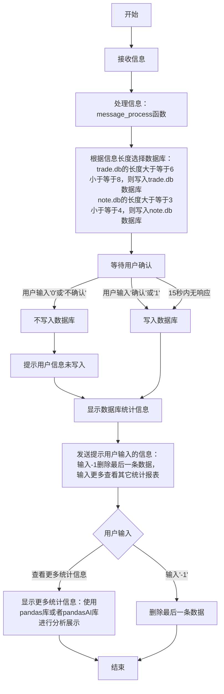

# 信息处理流程图

以下是基于提供内容的信息处理流程图：

## 流程说明

1. **信息接收**：系统接收用户输入的信息
2. **信息处理**：对接收到的信息进行处理
3. **数据库选择**：根据处理后信息的长度选择要写入的数据库
4. **用户确认**：
   - 用户输入"确认"或"1"：确认信息并写入数据库
   - 用户输入"0"或"不确认"：表示信息错误，不写入数据库
   - 超过15秒不输入：系统自动写入数据库
5. **统计信息**：写入数据库后，系统显示数据库统计信息
6. **后续操作**：
   - 用户可以查看更多统计信息
   - 用户输入"-1"可删除最后一条数据 
