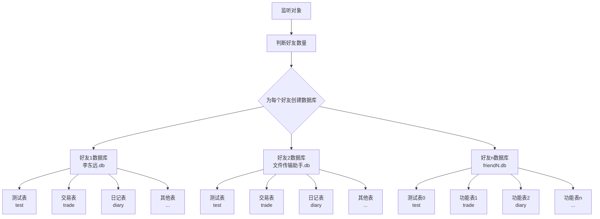

# 好友数据库结构图

## 结构说明

1. **监听对象**：系统监听好友数量
2. **数据库创建**：为每个好友创建独立的数据库
   - 数据库命名规则：使用好友名称命名
3. **表结构**：每个数据库包含以下表
   - **测试表**：用于测试目的
   - **交易表**：记录交易信息
   - **日记表**：记录日记内容
   - **其他表**：根据需要扩展的其他表结构 